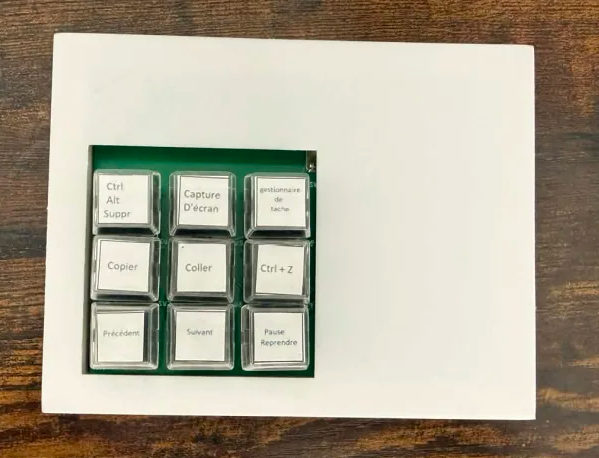
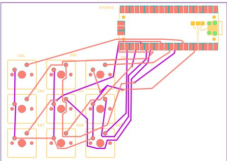

# MacroPad

Pavé de 9 touches programmables basé sur un Raspberry Pi Pico (RP2040) sous CircuitPython.
Il se branche en USB et est reconnu comme un clavier (raccourcis + touches média), sans driver.
Un logiciel PC permet de changer l'action de chaque touche sans reprogrammer le Pico.

Projet réalisé par Mathyou ANDRE dans le cadre du chef-d'œuvre Bac Pro CIEL, au LPP Le Marais Sainte-Thérèse.



## Structure

```
MACROPAD/
├── firmware/        Code CircuitPython à copier sur le Pico (boot.py, code.py)
├── configurator/    Logiciel PC de configuration (Python / Tkinter)
├── hardware/
│   ├── schematic/   Schéma électronique (PDF, PNG, source EasyEDA)
│   ├── pcb/         PCB : source Fritzing, Gerber pour la fabrication, PDF
│   ├── case/        Boîtier 3D (Fusion 360 + STL pour l'impression)
│   └── libraries/   Composants Fritzing nécessaires pour ouvrir le PCB
└── docs/            Images du README
```

## Démarrage rapide

1. **Flasher le Pico** : voir [firmware/README.md](firmware/README.md).
2. **Configurer les touches** : lancer le configurateur (voir [configurator/README.md](configurator/README.md)).

## Configuration par défaut

| Touche | GPIO | Action |
|---|---|---|
| SW1 | GP28 | Ctrl + Alt + Suppr |
| SW2 | GP27 | Capture d'écran (Win + Shift + S) |
| SW3 | GP26 | Gestionnaire des tâches (Ctrl + Shift + Échap) |
| SW4 | GP22 | Copier (Ctrl + C) |
| SW5 | GP21 | Coller (Ctrl + V) |
| SW6 | GP20 | Fermer l'onglet (Ctrl + W) |
| SW7 | GP19 | Piste précédente |
| SW8 | GP18 | Piste suivante |
| SW9 | GP17 | Lecture / Pause |

Chaque switch relie son GPIO au 3V3. Le firmware active la résistance de pull-down interne.

## Matériel

- **Schéma** : `hardware/schematic/schematic.pdf`
- **PCB** : conçu avec Fritzing 0.9.9 (`hardware/pcb/MACROPAD-FRIT.fzz`).
  Pour l'ouvrir, importer d'abord les composants de `hardware/libraries/fritzing/`.
  Les fichiers de fabrication sont dans `hardware/pcb/gerber.rar` (visualisables avec gerbv).
- **Boîtier** : `hardware/case/macropad-case.stl` pour l'impression, `.f3d` pour le modifier dans Fusion 360.



## Licence

MIT — voir [LICENSE](LICENSE).
